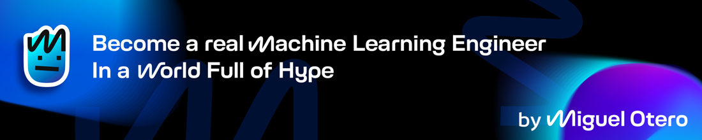
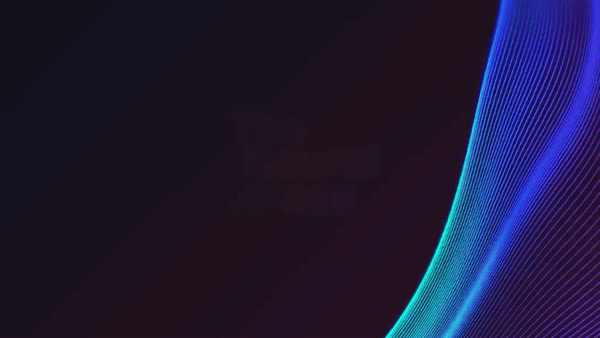

<h1 align="center">
  <em>Learn to build AI Systems that actually work</em>
</h1>

Welcome to [The Neural Maze](https://theneuralmaze.substack.com/) 👋

Your one-stop hub for **machine learning (ML)** projects, explained step-by-step with **code**, **articles** and **video tutorials**.

---

### 🎯 What You'll Find Here

The Neural Maze Github Organization contains all the code related to the projects I'm working on, have worked on or plan to work on 😂 

Here's what you can expect:

#### 📺 YouTube Projects

The source code for the [YouTube videos](https://www.youtube.com/@TheNeuralMaze) I publish on my channel. Follow along as we build, experiment and learn together.

#### ✍️ Substack Articles

The source code for my [Substack articles](https://theneuralmaze.substack.com/).

#### 💡 Experimental Projects

Random but interesting projects I come up with - because learning is all about exploration! 😎

---

### 🚀 Stay connected

Let's keep in touch!

💌 If you have questions or ideas for cool ML projects, or you are considering some collaboration, please, I'd love to hear from you! 

Reach out at theneuralmaze@gmail.com.

Happy coding! 👨‍💻👩‍💻

  

